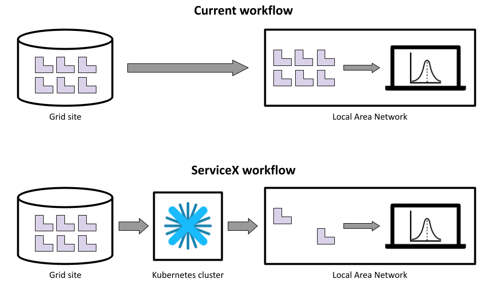
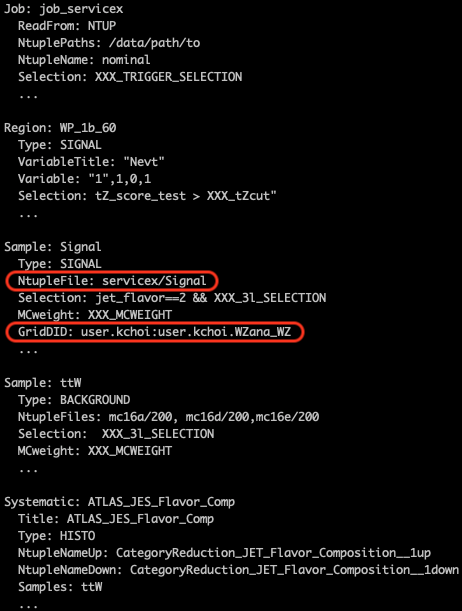
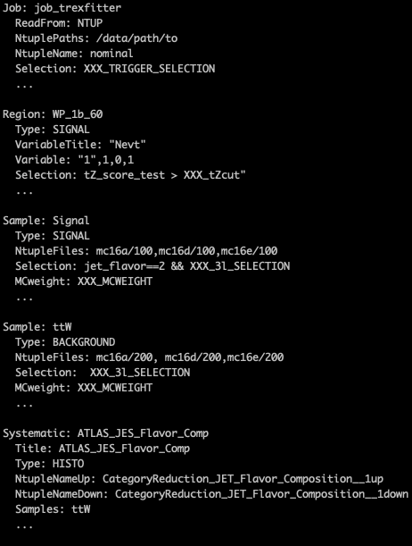

# ServiceX for TRExFitter

For GitHub and PyPI release v1.1.0

## Overview

[`ServiceX`](https://github.com/ssl-hep/ServiceX), a component of the IRIS-HEP DOMA group's iDDS, is an experiment-agnostic service to enable on-demand data delivery from data lakes in different data formats, including Apache Arrow and ROOT ntuple. 

[`TRExFitter`](https://gitlab.cern.ch/TRExStats/TRExFitter) is a popular framework to perform profile likelihood fits in ATLAS experiment. It takes ROOT histograms or ntuples as input. Long turnaround time of ntuple reading for large and/or remote data would slow down the whole analysis.

<!-- `servicex-for-trexfitter` is a python library to interface ServiceX into TRExFitter framework. It provides an alternative method to produce histograms out of ROOT ntuples.  -->

[`servicex-for-trexfitter`](https://github.com/kyungeonchoi/ServiceXforTRExFitter) is a Python package to integrate `ServiceX` into the `TRExFitter` framework.
It provides an alternative workflow if you use `ROOT` ntuples as inputs.
The package analyzes your `TRExFitter` configuration file, and delivers only necessary branches and entries to produce all histograms defined in your `TRExFitter` configuration file.

The default workflow requires to download all `ROOT` ntuples to your local machine or CERN EOS area from the grid.
The workflow using `servicex-for-trexfitter`, on the the other hand, delivers only a subset of `ROOT` ntuples.
It practically replaces the step to download `ROOT` ntuples from the grid using `Rucio`.

<!-- Primary goal is the fast delivery of histograms from ROOT ntuples, which replaces TRExFitter option `n`.  -->



The main advantages are:

- Disk space: No need to store all `ROOT` ntuples locally.
A reduction on the delivered `ROOT` ntuples by `servicex-for-trexfitter` varies accoring to the setting in your `TRExFitter` configuration file.
- Faster turnaround: Download of `ROOT` ntuples can be faster for `servicex-for-trexfitter` as it parallelizes your job up to each `TTree` of each file and delivers smaller `ROOT` ntuples over WAN.
Processing time of `TRExFitter` option `n` is naturally faster for the workflow using `servicex-for-trexfitter` as it runs over smaller `ROOT` ntuples.
- Simplicity: A single `TRExFitter` configuration file to get `ROOT` ntuples from the grid using `servicex-for-trexfitter` and all other `TRExFitter` steps. No separate script needed to download all `ROOT` ntuples from the grid.


## Prerequisites

- Python 3.6, 3.7, or 3.8
- Access to an *Uproot* ServiceX endpoint. More information about ServiceX can be found at [ServiceX documentation](https://servicex.readthedocs.io/en/latest/)


## Usage

### Installation

The library is published at PyPI: [servicex-for-trexfitter](https://pypi.org/project/servicex-for-trexfitter/)

### Prepare TRExFitter configuration

The followings are the settings needed for the workflow using `servicex-for-trexfitter`:

#### `Job` block settings

- `NtuplePaths: <PATH>` 
    - The path where input root files are stored. 
    - Write permission is required as ServiceX delivers root ntuples to the subdirectory `servicex` of this path.

#### `Sample` block settings

- `GridDID: <Rucio DID>`
    - Add option `GridDID` for the `Sample` using ServiceX for delivery.     
    - Both scope and name for `GridDID`, e.g., `user.kchoi:user.kchoi.WZana_WZ`.
    - Sample can have multiple DIDs: e.g., `user.kchoi:user.kchoi.WZana_WZ_mc16a, user.kchoi:user.kchoi.WZana_WZ_mc16d, user.kchoi:user.kchoi.WZana_WZ_mc16e`
    - `Sample` without an option `GridDID` is treated as a typical Sample, which reads ntuple files from local path.
- `NtupleFile: servicex/<SAMPLE NAME>`
    - `servicex-for-trexfitter` delivers one `ROOT` file per `Sample` with the same name as the `Sample` name.
    - This option is required only for the Samples with option `GridDID`. Other Samples can use any option valid for option NTUP.

Here is a side-by-side comparsion of example configuration files:

`servicex-for-trexfitter` | Default
:--------:|:------:
 | 

#### Caveat

- Only scalar-type of TBranch is supported. 
- Most of standard TCut expressions are supported for `Selection`,but special functions like `Sum$(formula)` are not supported yet. Please find more about the supported TCut expression [here](https://github.com/ssl-hep/TCutToQastleWrapper).

### Deliver `ROOT` ntuples

```python
from servicex_for_trexfitter import ServiceXTRExFitter
sx_trex = ServiceXTRExFitter("<TRExFitter configuration file>")
sx_trex.get_ntuples()
```

Once you load the package, you can define an instance with an argument of `TRExFitter` configuration file.
You can then ask for delivery of `ROOT` ntuples.
It will initiate `ServiceX` transformation(s) based on your `TRExFitter` configuration, and deliver `ROOT` ntuples to the path you specified at `NtuplePaths/servicex`.

### Local data cache

`ServiceX` provides the feature that caches your queries and data into a local temporary directory.
Therefore, whenever you make further changes to the `TRExFitter` configuration file, `servicex-for-trexfitter` creates data delivery requests only for the updated parts.

### Compatible TRExFitter framework

To run the subsequent steps of `TRExFitter` with the `ROOT` ntuples that `servicex-for-trexfitter` delivered, you need to checkout the branch `feat/servicex-integration` of `TRExFitter` framework.
Otherwise, `TRExFitter` will complain about the unknown options.
The feature branch will be merged into master in the near future.

## Acknowledgements
Support for this work was provided by the the U.S. Department of Energy, Office of High Energy Physics under Grant No. DE-SC0007890