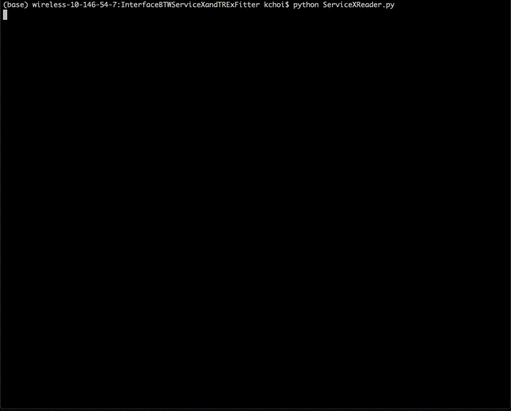

# ServiceX for TRExFitter

## Overview

[`ServiceX`](https://github.com/ssl-hep/ServiceX), a component of the IRIS-HEP DOMA group's iDDS, is an experiment-agnostic service to enable on-demand data delivery from data lakes in different data formats, including Apache Arrow and ROOT ntuple. 

[`TRExFitter`](https://gitlab.cern.ch/TRExStats/TRExFitter) is a popular framework to perform profile likelihood fits in ATLAS experiment. It takes ROOT histograms or ntuples as input. Long turnaround time of ntuple reading for large and/or remote data would slow down the whole analysis.

`ServiceXforTRExFitter` is a python library to interface ServiceX into TRExFitter framework. It provides an alternative method to produce histograms out of ROOT ntuples. 

<!-- Primary goal is the fast delivery of histograms from ROOT ntuples, which replaces TRExFitter option `n`.  -->

Expected improvements:
<!-- - Faster turnaround: this library analyzes your TRExFitter configuration to apply preselection (or filtering) on the ntuples and deliver only necessary branches. -->
- Faster turnaround: this library analyzes your TRExFitter configuration and performs on-the-fly transformation to apply preselection (or filtering) on the ntuples and delivers only necessary branches.
- Disk space: ServiceX reads files on grid, thus no need to have a direct access to ROOT ntuples.
- Scalability: ServiceX is running on a K8s cluster which can easily scale the job.

Possible bottlenecks:
- Bad network speed between the grid site and the K8s cluster where ServiceX deployed.
- Parquet to ROOT ntuple conversion is currently being done on your PC or laptop.

<!-- ServiceX for TRExFitter is a python library 
which delivers only needed data based on the TRExFitter configuration file
to deliver only data used by TRExFitter interactively. -->

## Prerequisites

- Python 3.6, 3.7, or 3.8
- Access to an *Uproot* ServiceX endpoint. More information about ServiceX can be found at [ServiceX documentation](https://servicex.readthedocs.io/en/latest/)
- PyROOT

## Usage

### Prepare TRExFitter configuration

The following items of TRExFitter configuration is required to modified to be compatible with the library:

- In `Job` block:  `NtuplePaths` has to be `<YOUR JOB NAME>/Data`
- In `Sample` block: specify NEW option `GridDID` for each `Sample`, where `GridDID` is a Rucio data indentifier which includes scope and name. 
- In `Sample` block: `NtupleFile` has to be the same name as `Sample` name

An example TRExFitter configuration can be found [here](https://github.com/kyungeonchoi/ServiceXforTRExFitter/blob/development/config/v9fit_simple.config).

### Delivery of slimmed/skimmed ROOT ntuples
<!-- ```
from servicex_for_trexfitter import ServiceXTRExFitter
sx_trex = ServiceXTRExFitter('<TRExFitter configuration file>')
sx_trex.get_ntuples()
``` -->
The library can be loaded by the following command
```
from servicex_for_trexfitter import ServiceXTRExFitter
```

and then an instance can be created with an argument of TRExFitter configuration file.
```
sx_trex = ServiceXTRExFitter('<TRExFitter configuration file>')
```

Now you are ready to make a delivery request. 
```
sx_trex.get_ntuples()
```
It will initiate ServiceX transformation(s) based on your TRExFitter configuration, and deliver ROOT ntuples that are effectively slimmed and skimmed.

### Prepare histograms from delivered ROOT ntuples

Now you can run TRExFitter with the action `n` to read input ntuples from the delivered ROOT ntuples. 
Given that the current TRExFitter framework doesn't support `ServiceXforTRExFitter` yet, the option `GridDID` in `Sample` block has to be deleted before you run TRExFitter.


<!-- configuration file -->

<!-- ## Limitations -->

<!-- ## Current version
The current version (`v0.4`) supports a simplified TRExFitter configuration file which contains one Region and multiple Samples. It performs very similarly to the `n` step of TRExFitter which extract histograms from flat-ntuple with selection. Log file will be generated under directory `log`. The output histogram is normalized to the luminosity set by the configuration file.  -->

<!-- ## Usage -->


<!-- The following script runs the `ServiceXforTRExFitter`:
```
python ServiceXReader.py
```
which performs following steps in order:
- Step 1: Check helm chart for SerivceX is deployed and running in good condition
- Step 2: Prepare backend to make a request
- Step 3: Prepare transform requests
- Step 4: Make requests
- Step 5: Monitor jobs
- Step 6: Prepare backend to download output
- Step 7: Download output
- Step 8: Post processing
- Step 9: Disconnect from backends

You have to specify a Grid DID name for a sample in your TRExFitter configuration file.

## Example 
The following shows the real-time demo of the `ServiceXforTRExFitter`: 



The output histogram is located at `v9/Histograms/ttHML_l30tau_ttH_histos.root`.  -->

## Acknowledgements
Support for this work was provided by the the U.S. Department of Energy, Office of High Energy Physics under Grant No. DE-SC0007890